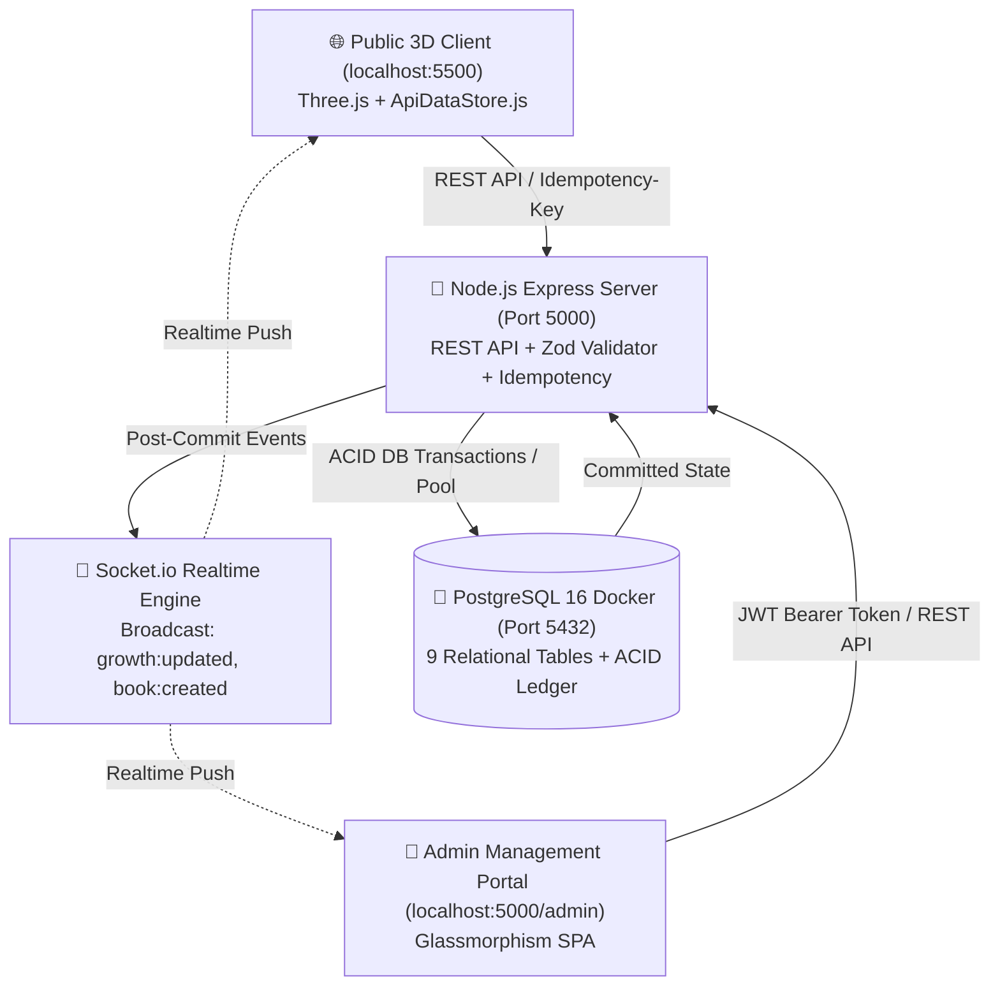

# 🌳 Cáo Sách — Full-Stack Realtime Knowledge Ecosystem

<p align="center">
  
</p>

<p align="center">
  <strong>Hệ sinh thái Tri thức Số 3D thời gian thực — Nơi mỗi cuốn sách là một hạt mầm, mỗi độc giả là một người vun đắp phù sa nuôi dưỡng Cây Tri Thức Cổ Thụ.</strong>
</p>

<p align="center">
  
  
  
  
  
  
  
</p>

---

## 📑 Mục Lục
1. [Giới Thiệu Tổng Quan](#-giới-thiệu-tổng-quan)
2. [Kiến Trúc Hệ Thống (Full-Stack Architecture)](#-kiến-trúc-hệ-thống-full-stack-architecture)
3. [Cơ Sở Dữ Liệu PostgreSQL & 9 Bảng Chuẩn Hóa](#-cơ-sở-dữ-liệu-postgresql--9-bảng-chuẩn-hóa)
4. [Luồng Nghiệp Vụ Chính (Core Business Flows)](#-luồng-nghiệp-vụ-chính-core-business-flows)
5. [Hướng Dẫn Cài Đặt & Chạy Cục Bộ (Developer Quickstart)](#-hướng-dẫn-cài-đặt--chạy-cục-bộ-developer-quickstart)
6. [Bảng Điều Khiển Quản Trị (Admin Management Portal)](#-bảng-điều-khiển-quản-trị-admin-management-portal)
7. [Bảng Điều Khiển Tester (Testing Suite & Simulation)](#-bảng-điều-khiển-tester-testing-suite--simulation)
8. [Kiểm Thử Tự Động (Automated Testing)](#-kiểm-thử-tự-động-automated-testing)
9. [Cấu Trúc Thư Mục (Project Structure)](#-cấu-trúc-thư-mục-project-structure)

---

## 📖 Giới Thiệu Tổng Quan

**Cáo Sách** là một nền tảng văn hóa đọc kết hợp đồ họa không gian 3D tương tác (**Three.js/WebGL**) và hệ thống máy chủ cơ sở dữ liệu thời gian thực (**Node.js Express + PostgreSQL trong Docker + Socket.io**).

- **Gieo mầm tri thức**: Mỗi cuốn sách độc giả đóng góp hóa thành 1 hạt giống ủ mình dưới đất (giai đoạn hạt mầm) hoặc bón phân tiếp thêm dinh dưỡng giúp Cây Tri Thức vươn cành đón nắng.
- **Tự động duyệt 100% (Auto-Approve)**: Sách sau khi gửi được hiển thị ngay lập tức trên hệ sinh thái và được cấp `+15 EXP` vào Cây thông qua giao dịch ACID PostgreSQL.
- **Hậu kiểm an toàn (Post-Moderation)**: Ban quản trị kiểm soát chất lượng nội dung thông qua Admin Portal chuyên biệt, có quyền chỉnh sửa, duyệt an toàn hoặc ẩn nội dung vi phạm.

---

## 🏗️ Kiến Trúc Hệ Thống (Full-Stack Architecture)



---

## 🗄️ Cơ Sở Dữ Liệu PostgreSQL & 9 Bảng Chuẩn Hóa

Hệ thống sử dụng **PostgreSQL 16 Alpine** chạy trong Docker container (`caosach-postgres`):

1. **`admin_users`**: Quản lý tài khoản quản trị viên với phân quyền RBAC (`reader`, `moderator`, `admin`) và mật khẩu băm `bcrypt`.
2. **`community_growth`**: Bảng Singleton (ID=1) lưu trữ chỉ số tăng trưởng toàn cầu: `total_exp`, `level` (0–5), `total_books`, `total_dews`, `total_likes`, `active_readers`.
3. **`books`**: Lưu trữ tác phẩm và trích dẫn sách. Tách biệt rõ ràng:
   - `visibility_status`: `visible` (hiển thị), `hidden` (tạm ẩn), `deleted` (đã xóa).
   - `moderation_status`: `pending_review` (chờ hậu kiểm), `reviewed` (đã duyệt an toàn), `flagged` (bị báo cáo), `rejected` (bị từ chối).
4. **`exp_ledger`**: Sổ cái kép ghi vết toàn bộ biến động EXP (`BOOK_CONTRIBUTION`, `QUOTE_LIKE`, `DAILY_DEW`, `FRUIT_HARVEST`, `ADMIN_BONUS`, `MODERATION_PENALTY`).
5. **`daily_dews`**: Lưu lượt nhận sương mai mỗi ngày với ràng buộc `UNIQUE(user_fingerprint, claim_date)` chống spam.
6. **`quote_likes`**: Lưu lượt thả tim trích dẫn với ràng buộc `UNIQUE(user_fingerprint, book_id)`.
7. **`fruit_harvests`**: Lưu lượt hái quả tri thức với ràng buộc `UNIQUE(user_fingerprint, fruit_index, harvest_date)`.
8. **`idempotency_keys`**: Lưu cache phản hồi theo `Idempotency-Key` header để chống trùng lặp request khi mạng lag hoặc bấm đúp.
9. **`audit_logs`**: Nhật ký kiểm toán ghi vết mọi hành động can thiệp của Quản trị viên (Thời gian, Admin ID, Hành động, Metadata, IP Address).

---

## ⚡ Luồng Nghiệp Vụ Chính (Core Business Flows)

### 1. Luồng Gieo Mầm Sách (Auto-Approve 100%):
1. Client gửi `POST /api/v1/books/contribute` kèm `Idempotency-Key` và payload thông tin sách.
2. Server xác thực dữ liệu qua schema Zod.
3. Mở **PostgreSQL Transaction**:
   - `INSERT INTO books` với `visibility_status = 'visible'` và `moderation_status = 'pending_review'`.
   - `INSERT INTO exp_ledger` ghi nhận `+15 EXP` loại `BOOK_CONTRIBUTION`.
   - `UPDATE community_growth` cộng thêm 15 EXP, cập nhật cấp độ cây (Level 0–5).
   - **COMMIT TRANSACTION**.
4. Sau khi commit thành công: Socket.io phát sóng `growth:updated` và `book:created` tới toàn bộ client online để Cây 3D vươn cành tức thì.

### 2. Thuật Toán Cấp Độ Cây (Level & EXP Thresholds):
- **Level 0 (0 – 49 Hạt/EXP 🌰)**: Cây ủ mầm dưới đất, hiển thị các hạt giống trên mặt đất.
- **Level 1 (50 – 149 EXP 🌱)**: Mầm non mới nhú (~150px) vươn lên đón nắng.
- **Level 2 (150 – 349 EXP 🌿)**: Cây non hóa gỗ vững chãi, xòe rộng 2 tầng cành lá.
- **Level 3 (350 – 699 EXP 🌳)**: Cây tơ vươn cành rợp bóng sum sê 3 tầng cành.
- **Level 4 (700 – 1,199 EXP 🌲🍎)**: Cây đại thụ trưởng thành, kết **36 Trái Tri Thức 🍎** trên cành.
- **Level 5 ($\ge$ 1,200 EXP 👑✨)**: Đại Cổ Thụ Tri Thức Ngàn Năm, kết **52 Trái Tri Thức 🍎**, tỏa hào quang đom đóm rực rỡ.

---

## 🚀 Hướng Dẫn Cài Đặt & Chạy Cục Bộ (Developer Quickstart)

### Yêu cầu tiên quyết:
- **Docker Desktop** (Đang chạy).
- **Node.js** v18+ & **npm**.
- **Python 3** (Dùng để chạy server tĩnh client).

### Bước 1: Khởi động Cơ sở Dữ liệu PostgreSQL trong Docker
```bash
# Tại thư mục gốc dự án
docker-compose up -d
```
> Database container `caosach-postgres` sẽ chạy trên cổng `5432:5432`.

### Bước 2: Cài đặt và Khởi tạo Backend Server
```bash
cd server
npm install

# Tạo file .env từ mẫu (nếu chưa có)
cp .env.example .env

# Chạy DDL migration tạo 9 bảng PostgreSQL
npm run migrate

# Nạp dữ liệu mẫu ban đầu (SuperAdmin + Danh ngôn tinh hoa)
npm run seed
```

### Bước 3: Khởi chạy Backend Express Server
```bash
# Tại thư mục server/
npm start
# Hoặc chế độ dev tự động reload:
npm run dev
```
> Backend API sẽ lắng nghe tại: `http://localhost:5000`  
> Admin Management Portal: `http://localhost:5000/admin/`

### Bước 4: Khởi chạy Frontend 3D Client
```bash
# Mở một terminal mới tại thư mục gốc dự án
python -m http.server 5500
```
> Trải nghiệm giao diện Cáo Sách 3D tại: **`http://localhost:5500/`**

---

## 👑 Bảng Điều Khiển Quản Trị (Admin Management Portal)

- **Địa chỉ truy cập**: `http://localhost:5000/admin/` *(hoặc `http://localhost:5500/admin/`)*
- **Tài khoản mặc định**:
  - Tên đăng nhập: `admin`
  - Mật khẩu: `admin123`
- **Chức năng chính**:
  - 📊 **Theo dõi tăng trưởng**: Xem điểm EXP toàn cầu, tiến trình Level cây và trạng thái kết nối Realtime Socket.io.
  - 📋 **Live Moderation Feed**: Hậu kiểm danh sách sách mới gieo theo thời gian thực:
    - 🔍 Tìm kiếm theo tên sách, tác giả, người gieo.
    - 🏷️ Bộ lọc trạng thái (`pending_review`, `reviewed`, `flagged`, `rejected`, `visible`, `hidden`, `deleted`).
    - ⚡ Thao tác nhanh: **Duyệt an toàn (Reviewed)** hoặc **Ẩn sách khỏi Cây (Hidden/Deleted)** kèm lý do hậu kiểm.

---

## 🧪 Bảng Điều Khiển Tester (Testing Suite & Simulation)

Tích hợp sẵn công cụ hỗ trợ Developer kiểm thử trực tiếp sinh thái:
- Bấm vào nút **🧪 Tester Option** ở góc dưới cùng bên trái màn hình (hoặc nhấn phím **`T`**).
- **Các tính năng kiểm thử**:
  - ⚡ **Chuyển giai đoạn nhanh**: 0 hạt, 15 hạt, 30 hạt, 45 hạt, Level 1 (50 hạt), Level 2 (150 EXP), Level 3 (400 EXP), Level 4 (1000 EXP), Level 5 (2500+ EXP).
  - 🎚️ **Slider tăng trưởng liên tục**: Kéo từ `0` đến `3000 EXP` để quan sát cây 3D lớn dần theo thời gian thực.
  - 🎮 **Mô phỏng tương tác**: Gieo thử +1, +10, +50 hạt mầm, thả +10 tim (+20 EXP).
  - ↺ **Reset về ban đầu**: Dọn dẹp dữ liệu test, đưa PostgreSQL về trạng thái 0 hạt mầm ban đầu.

---

## 🧪 Kiểm Thử Tự Động (Automated Testing)

Dự án trang bị bộ kiểm thử tự động toàn diện kiểm tra tính đúng đắn của logic tính điểm EXP, ACID Transaction, ràng buộc chống spam và phân quyền:

```bash
cd server
npm test
```

### Kết quả kiểm thử:
- ✅ **Unit Tests**: Kiểm tra công thức toán học và ngưỡng phần trăm thăng hạng Level 0–5.
- ✅ **Integration Tests**: Kiểm tra Transaction gieo sách, auto-approve và ghi sổ kép `exp_ledger`.
- ✅ **Anti-Spam Constraints**: Kiểm tra ràng buộc `UNIQUE` chống spam tưới sương và like trích dẫn ở tầng DB.
- ✅ **Admin Moderation & Audit**: Kiểm tra xác thực JWT, phân quyền và ghi nhật ký `audit_logs`.

---

## 📂 Cấu Trúc Thư Mục (Project Structure)

```text
Sach-tri-thuc/
├── admin/                      # Custom-coded Admin Management Portal (SPA)
│   ├── admin.css               # Glassmorphism dark theme styling
│   ├── admin.js                # Quản lý phiên JWT, REST API & Socket.io listener
│   └── index.html              # Giao diện chính của Admin Dashboard
├── assets/
│   ├── data/
│   │   ├── ApiDataStore.js     # Client Data Adapter (REST API + Socket.io + Offline cache)
│   │   └── MockDataStore.js    # Re-export tương thích ngược
│   ├── effects/                # Hiệu ứng hạt ánh sáng & bụi khí sinh thái
│   ├── ground/                 # Tài nguyên mặt đất & chân trời
│   ├── services/               # DailyDewService, QuoteCardExporter
│   ├── sky/                    # Shaders bầu trời 24h & Three.js runtime
│   ├── tester/
│   │   └── TesterPanel.js      # Bảng điều khiển kiểm thử 50 hạt & 5 level cây
│   └── tree/                   # Thuật toán Procedural 3D Tree & WisdomFruitManager
├── docker-compose.yml          # PostgreSQL 16 Alpine container configuration
├── index.html                  # Giao diện chính ứng dụng Độc giả Cáo Sách 3D
├── server/                     # Backend Node.js Express & PostgreSQL Engine
│   ├── config/
│   │   ├── constants.js        # Cấu hình EXP & toán học cấp độ cây
│   │   └── database.js         # PostgreSQL connection pool & transaction helper
│   ├── controllers/            # Controller xử lý nghiệp vụ sách, sương, tim, admin, tester
│   ├── middlewares/            # Auth JWT, Zod validator, Idempotency, Error handler
│   ├── routes/                 # API routes (/api/v1, /api/v1/admin, /api/v1/tester)
│   ├── scripts/
│   │   ├── migrate.js          # DDL Migration 9 bảng PostgreSQL
│   │   ├── seed.js             # Nạp dữ liệu Admin & trích dẫn mẫu
│   │   └── run-tests.js        # Automated test runner suite
│   ├── services/               # Business logic & Socket.io broadcasters
│   ├── tests/                  # Unit & Integration test specs
│   ├── package.json            # Node.js dependencies
│   └── server.js               # Entry point máy chủ Express & Socket.io
└── README.md                   # Tài liệu hướng dẫn dự án toàn diện
```

---

<p align="center">
  Được phát triển với 💚 bởi đội ngũ <strong>Cáo Sách</strong> • Vì tình yêu và sự trường tồn của văn hóa đọc Việt Nam
</p>
